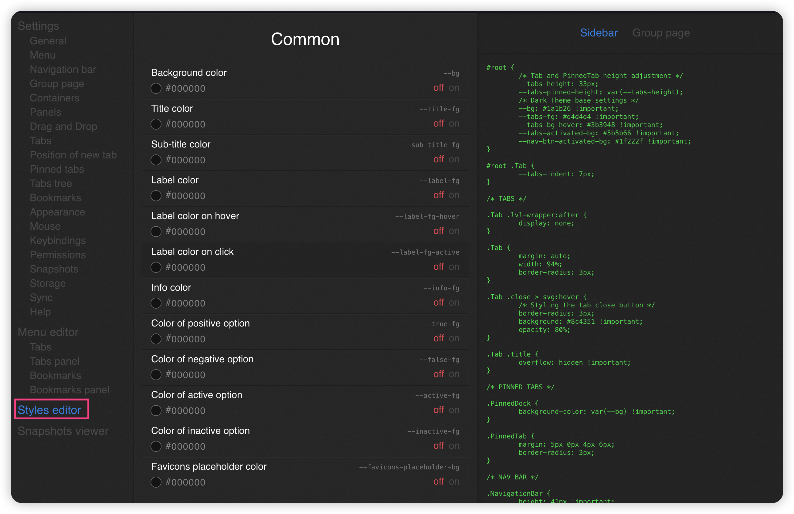

# VerticalFox
Get an Edge like auto-hide vertical tabs bar on Firefox! Powerd by Sidebery, you can have your bookmarks, pinned tabs all in side bar and get a minimalism look.

## How to apply
1. You need to have [Sidebery](https://addons.mozilla.org/en-US/firefox/addon/sidebery/) installed.

2. If you haven't customized your Firefox before, check out [this guide](https://www.reddit.com/r/firefox/wiki/userchrome/) for how to set up your Firefox and the profiles.
3. Once you have your `chrome` folder under your profile directory, paste the [userChrome.css](./userChrome.css) into it.
4. Go to the settings of Sidebery, go to **Styles editor**, paste all the code in [sidebery-styles.css](./sidebery_styles.css).

Now you can enjoy your new Firefox!