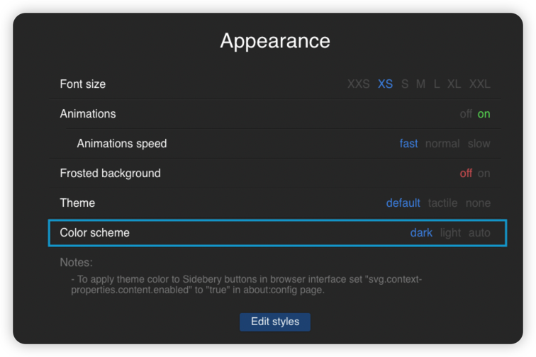

# VerticalFox
> ❗️❗️If you're, or going to use this setup, **DO NOT UPGRADE TO Sidebery v5.** If you have, remove it and install v4.10 [here](https://addons.mozilla.org/en-US/firefox/addon/sidebery/versions/), then turn off auto update.

[中文文档](readme_ch.md)

Get an Edge like auto-hide vertical tabs bar on Firefox! Powerd by Sidebery, you can have your bookmarks, pinned tabs all in side bar and get a clean, compact look. Support MacOS and Windows.

   

   

**I'm only working on compatability with the latest stable release of Firefox, if you find any flaws, please update your browser first.**

*The auto hide also works on Tree Style Tabs, but you may need to adjust the css to achieve the best look.*

## How to apply

1. You need to have [Sidebery](https://addons.mozilla.org/en-US/firefox/addon/sidebery/) installed.
2. Download the files in release according to your operation system. You can also directly use the source files you need.
3. If you haven't customized your Firefox before, check out [this guide](https://www.reddit.com/r/firefox/wiki/userchrome/) for how to set up your Firefox and the profiles. TL;DR version:

   1. Navigate to `about:config` in the address bar and accept the risks.
   2. Search for `toolkit.legacyUserProfileCustomizations.stylesheets` and toggle it to true (by double clicking on it).
   3. Navigate to `about:support` in the address bar, under **Application Basics**, find **Profile Folder** and open it. You should now see your profile folder.
   4. Inside your profile folder, create a new folder named `chrome` (all lower case).
4. Once you have your `chrome` folder under your profile directory, copy the `userChrome.css` you downloaded into `chrome`. Alternatively you can create a blank `userChrome.css` and paste the code. Restart your browser.
5. Go to the settings of Sidebery, go to **Styles editor**, paste all the code from `sidebery_styles.css`. 

   

When you switch between light and dark browser theme, remember to also change it in sidebery settings for best experience: appearance -> color scheme

   

Now you can enjoy your new Firefox!

## Frequently Asked
Q: **Dark mode doesn't work (or behaves abnormally).**

A: Set your system theme as dark, then set your Firefox theme as 'auto' in **Extensions & Themes**. If it still doesn't work, go to releases and use the files in the **dark only** release.

 

Q: **How to move sidebar to the right?**

A: Before you apply `userChrome.css`, click the header of sidebar, click 'move to right side'. If you have applied `userChrome.css`, find the comment `/*hide the sidebar header*/` then delete or comment out the section between this comment and `/*AUTO HIDE SIDEBAR*/`, the header will appear. 

 

Q: **How to disable sidebar auto-hide?**

A: Go to the comment `/*AUTO HIDE SIDEBAR*/`, delete the next 10 lines of code below it.
