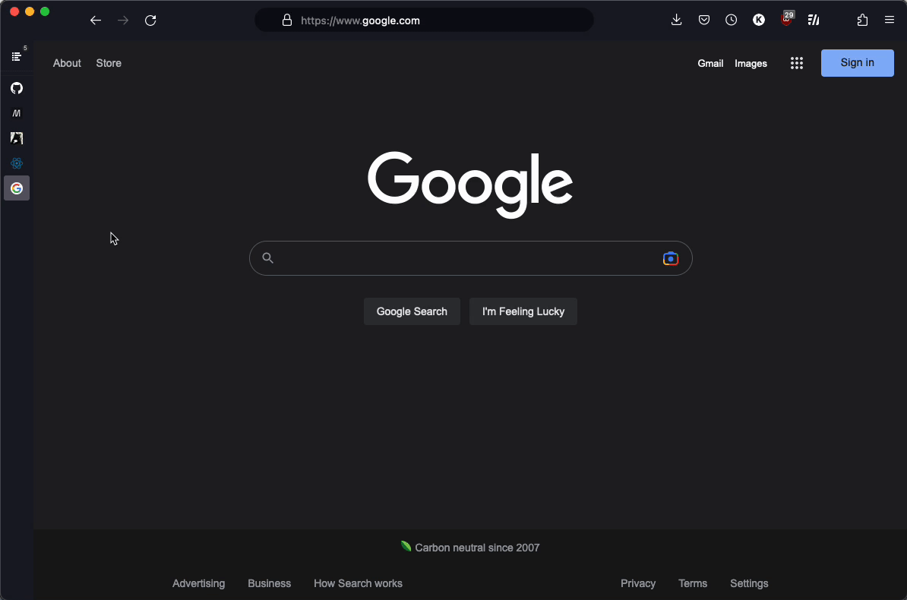

# VerticalFox

在 Firefox 上你也能拥有 Edge 浏览器的自动伸缩垂直标签栏！该主题配合 Sidebery 插件使用，所以收藏夹、标签置顶、独立工作区等功能都一并集成到了侧边栏中，赋予你的 Firefox 一个干净、极简的外观。同时支持 MacOS 与 Windows。

# 安装指南

1. 安装 [Sidebery](https://addons.mozilla.org/en-US/firefox/addon/sidebery/) 插件。
2. 根据你所使用的操作系统，下载 release 中的压缩包并解压。（如果你熟悉 Firefox 自定义，你可以直接在源码中找到你要的文件）
3. 在地址栏中输入 `about:config` 并前往，接受风险提示。
4. 搜索 `toolkit.legacyUserProfileCustomizations.stylesheets` 并双击设置为 true。
5. 在地址栏中输入 `about:support` 并前往，在 **Application Basics** 中找到 **Profile Folder** 并打开。
6. 在打开的目录下新建 `chrome` 文件夹，名称必须全部小写。
7. 复制下载好的 `userChrome.css` 到 `chrome` 文件夹中，重启浏览器。
8. 打开 Sidebery 的设置，前往 **Styles Editor**，在右侧复制粘贴 `sidebery_styles.css` 中的代码。
   

当切换浏览器的亮色/暗色主题时，在 sidebery 设置中也需要进行切换以获得最佳体验：

一切就绪！
